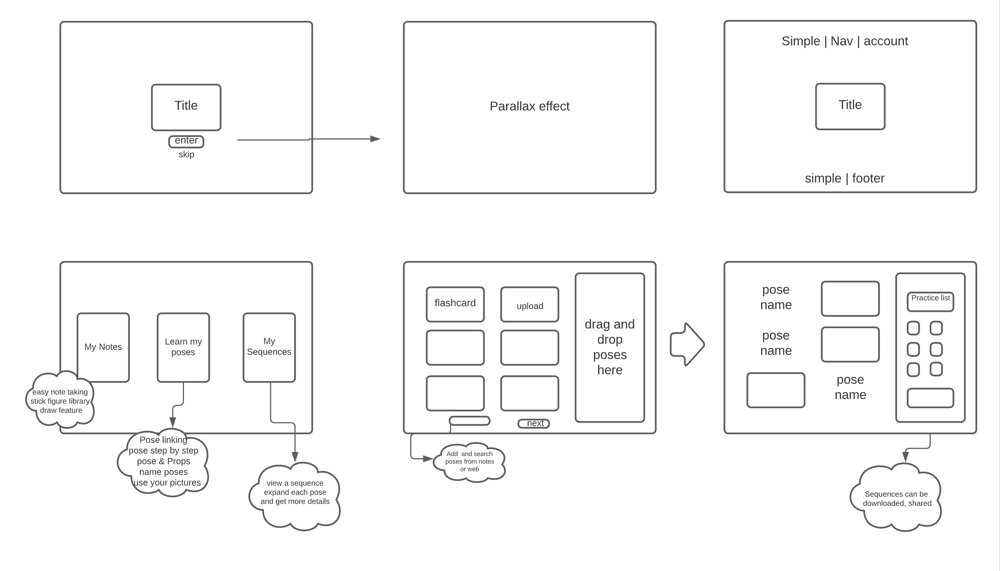

# Intensive-Fall-2020
Fall 2020 intensive project

YOGA

yoga will help yoga students take notes, study, and come up with a schedule for at home practice.

******learn to be your own best friend********

1. Notes: notes will de carefully indexed to easilly access later. Note  taking will be easy and fun  using built in "emoji" pose stick figure drawings and common yoga props such as belts blocks, so notes can be taken quicker and drawings more accurate. Other features will include adding photographs and audio.

2. Study: students can customize flash-cards with their own photographs of a pose from their notes and name their poses, or use the provided images to upload onto the "study with flash card" feature. all flash cards easily categorized by date, subject or sequence. ie; student can search up: flash cards on poses for a sequence that aliviates backpain...than all flas cards populate.

3. Schedule Builder: collapsible side bar that will allow students to drag and drop key points from notes, flash card pictures and pose names, inspirational quotes and even chants to build a daily practice list that can also be saved for later re use!

      ie: Tuesday October 20th 2020

                
             5 minute video from a worshop explaining what I want to work on.
--------------------------------------------------
           - I will work on: Twists
           - with a common thread of: lifting the arches, releasing the brain 

                    **chant**
           pose sequence

           ------------------  picture
           ------------------  picture

           ...
           Savasana

hari om

